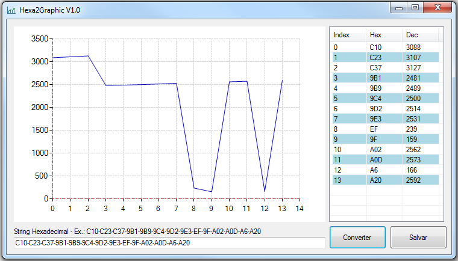

----
  
  
  
  # ** Hexa2Graphic.exe **
  
  Tool to print hexadecimal data as graphic (chart)
  
----
  
 ## Compiler x IDE
  
  Microsoft Visual Studio Professional 2019 / Version 16.6.5
  Microsoft Visual C# Tools 3.6.0-4.20251.5+910223b64f108fcf039012e0849befb46ace6e66 
  Microsoft .NET Framework Version 4 Client Profile
  
## Main screen
  
  
  
----
  